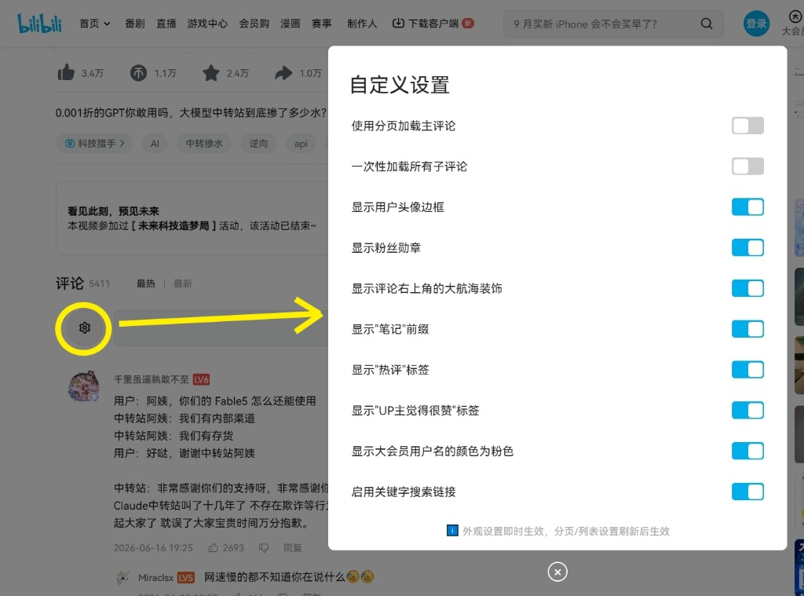
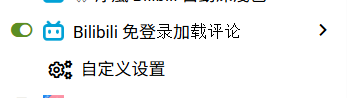

# 💬 Bilibili 免登入顯示留言 (Bilibili Login-Free Comment Display)

[](https://opensource.org/licenses/GPL-3.0)
[](https://github.com/pthuang01/bilibili-login-free-comments)
[](#-安裝方式)

在未登入 Bilibili（B站）的情況下，也能無障礙載入並瀏覽完整的評論區！保留官方原生的 UI 排版風格與互動細節，免除彈窗打擾與強制登入限制。

---

## ✨ 核心特色

- 🔓 **免登入暢讀**：無需登入帳號，自動獲取並渲染主評論與子評論。
- 🎨 **原生級 UI 還原**：
  - 完美還原官方字型、顏色、徽章排版及深淺色階。
  - 支援粉絲勳章、頭像框、大航海（艦長）裝飾卡片、大會員粉色暱稱、認證藍/黃 V 等標誌。
- ⏱️ **時間戳點擊跳轉**：智慧解析評論中的影片時間戳（如 `01:23`），點擊即可直達影片進度並自動播放。
- 🖼️ **圖片點擊放大**：整合 `Viewer.js`，支援評論圖片原圖預覽、縮放與拖曳。
- ⚙️ **靈活設定面板**：點擊頭像齒輪或油猴腳本選單即可開啟圖形化設定面板：
  - 切換「無限滾動載入」或「分頁器模式」。
  - 支援一鍵展開/載入所有子評論。
  - 自訂開關頭像框、粉絲牌、航海卡片、關鍵字搜尋標籤等外觀元素。
- 🛡️ **純淨防擾**：自動隱藏未登入強制彈窗、固定登入提示欄等視覺雜訊。

---

## 🌐 支援頁面

| 頁面類型 | 網址規則 | 支援狀態 |
| :--- | :--- | :---: |
| **一般影片** | `https://www.bilibili.com/video/*` | ✅ |
| **番劇 / 動漫 / 電影** | `https://www.bilibili.com/bangumi/play/*` | ✅ |
| **動態** | `https://t.bilibili.com/*` | ✅ |
| **專欄 (Opus)** | `https://www.bilibili.com/opus/*` | ✅ |
| **個人空間** | `https://space.bilibili.com/*` | ✅ |
| **專欄文章 (cv)** | `https://www.bilibili.com/read/cv*` | ✅ |
| **活動 / 節日頁面** | `https://www.bilibili.com/festival*` | ✅ |
| **播放清單 (List)** | `https://www.bilibili.com/list/*` | ✅ |
| **漫畫詳情 / 閱讀器** | `https://manga.bilibili.com/*` | ✅ |

> **備註**：當檢測到已登入（Cookie 中包含 `bili_jct` 或登入狀態為真）時，本腳本會自動停止執行，把控制權交還給 B 站原生模組，不影響帳號正常功能。

---

## 🚀 安裝方式

### 第一步：安裝瀏覽器腳本管理器
請根據你慣用的瀏覽器安裝對應的擴充套件：
- **Tampermonkey（油猴）**：[Chrome / Edge / Firefox](https://www.tampermonkey.net/)
- **Violentmonkey（暴力猴）**：[Chrome / Firefox](https://violentmonkey.github.io/)

### 第二步：安裝腳本
點擊下方連結直接進行安裝：
- 👉 **[從 GitHub Raw 安裝](https://raw.githubusercontent.com/pthuang01/bilibili-login-free-comments/main/bilibili-login-free-comments.user.js)**

*(若未來有上架 Greasy Fork，亦可在此加入 Greasy Fork 連結)*

---

## 🛠️ 設定與自訂

進入任何支援頁面後，你可以透過以下兩種途徑開啟設定視窗：
1. 點擊評論發表框左側的 **「齒輪圖示」**。
2. 點擊瀏覽器擴充功能列中的 **Tampermonkey 圖示** ➔ 選擇 **「自定義設置」**。

<p align="center">
  <br>
  <em>▲ 評論區齒輪按鈕與彈出式設定面板</em>
</p>

<p align="center">
  <br>
  <em>▲ 油猴腳本選單中的「自定義設置」入口</em>
</p>

### 可配置項目清單

| 設定項 | 預設值 | 說明 |
| :--- | :---: | :--- |
| **使用分頁加載主評論** | 關閉 | 開啟後主評論將改用數字分頁切換，關閉則為無限滾動加載 |
| **一次性加載所有子評論** | 關閉 | 展開二級回覆時是否一次性輪詢拉取全部評論 |
| **顯示用戶頭像邊框** | 開啟 | 顯示用戶客製化裝扮頭像框 |
| **顯示粉絲勳章** | 開啟 | 顯示用戶佩戴的實況主粉絲徽章及等級 |
| **顯示右上角大航海裝飾** | 開啟 | 顯示艦長、提督、總督專屬身份卡片 |
| **顯示「筆記」前綴** | 開啟 | 標記發布圖文筆記的標籤 |
| **顯示「熱評」標籤** | 開啟 | 標記熱門回覆標籤 |
| **顯示「UP主覺得很贊」標籤**| 開啟 | 標記獲得創作者按讚之標籤 |
| **顯示大會員用戶名為粉色** | 開啟 | 還原大會員專屬粉色暱稱外觀 |
| **啟用關鍵字搜尋連結** | 開啟 | 解析留言內提及的關鍵字與熱搜搜尋跳轉點 |

---

## 🏗️ 系統架構

本腳本採用模組化物件導向架構開發，保持高度可擴展性：

```plaintext
├── Env & Utils         # 環境全域物件代理、HTML 跳脫、BV 轉 AID 解碼、時間格式化
├── Config              # 常數表、WBI 簽名金鑰表、路由正則運算式配置
├── SettingsManager     # GM_getValue/setValue 配置存儲、動態 CSS 注入、UI 設定面板
├── ApiService          # WBI 簽名計算、Web API 評論抓取與動態資料載入
├── PageAdapters        # 各子頁面策略轉接器（抽取 oid、createrID、commentType）
├── MessageConverter    # 留言富文本轉化（表情符號、@標籤、時間戳、投影片與超連結）
├── ViewRenderer        # DOM 產生器、頭像/徽章渲染、Viewer.js 圖片放大綁定
└── CommentController   # 狀態流轉控制器、交會觀測器 (IntersectionObserver) 無限滾動排程
```

---

## 🤝 致謝與宣告 (Credits & License)

- 原版概念與原型來自：**[DD1969](https://github.com/DD1969)**
- 最佳化與維護：**DoReMi ([@pthuang01](https://github.com/pthuang01))**
- 依賴庫：
  - [Viewer.js](https://fengyuanchen.github.io/viewerjs/) - 圖片縮放檢視
  - [SparkMD5](https://github.com/satazor/js-spark-md5) - 用於 Bilibili WBI 簽名雜湊計算

本專案採用 **[GPL-3.0 License](LICENSE)** 開源授權，歡迎提出 Issue 或發送 Pull Request 共同改進！
